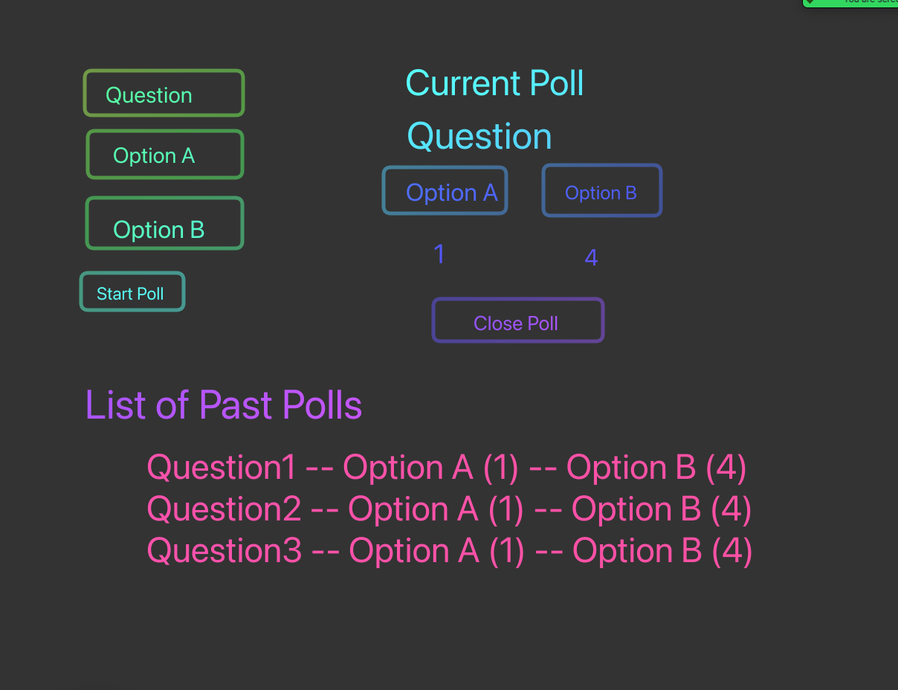

# Planning for Poll Tracker

## HTML Elements

-   Poll creation form (#create-poll):

    -   Question input
    -   Answer A input
    -   Answer B input
    -   Button to start poll

-   Current Poll Container

    -   `
` for the question and the options
    -   button for option A voting (#vote-a)
    -   button for option B voting (#vote-b)
    -   button to close poll (#close-poll)
    -   span for Option A votes
    -   span for Option B votes

-   List of Past Polls
-   `<ul>` for listing the polls
-   `<li>` for displaying the individual polls

## State

-   optionAVotes (integer)
-   optionBVotes (integer)
-   question (string / varchar)
-   optionA (string / varchar)
-   optionB (string / varchar)

## Supabase Table

name: polls
columns: option_a_votes, option_b_votes, option_a, option_b, question

## Events

1.  #create-poll onSubmit

-   create FormData from our form
-   user the FormData to "hydrate"
-   clear our form

2. #vote-a / #vote-b onClick

-   increment our optionAVotes or optionBVotes state
-   inject the state into our HTML

3. #close-poll onClick

-   create an object with our state
-   send that object to Supabase
-   rerender the list of polls

## Functions

-   `displayPolls` -- call Supabase, get a list of polls, and render each one
-   `renderPoll` -- take a single poll object, and create a DOM element for it
-   `displayCurrentPoll` -- inject the question, option info into the html
-   `createPoll` -- calls supabase
-   `getPolls` -- calls supabase

## Plan of Attack

1. Setup my HTML skeleton plus enough CSS to not drive myself crazy (ACP)
2. Form submit and getting the question data to display (ACP)
3. Get the voting working (ACP)
4. Create my supabase table
5. Get close poll button working -- submitting info to supabase (ACP)
6. Get list of polls displaying (ACP)
